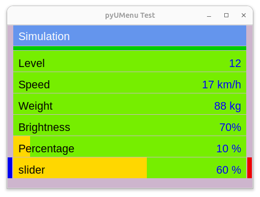

# pyUMenu - a Python Cross Platform, Menu based User Interface

As more even the smallest controller devices have some tiny displays today, as more projects make some use of it.

While many projects certainly need some beautiful tailored UIs, there are on the other side many mostly technical apps, which do not care about beauty 
and just want to give the user some ways to act with the application. In such cases its mostly annoying to create a new UI each time from scratch again- thats where UI toolkits come in place.

In python there are many beautiful toolkits available (Kivy, dearpyGui etc.), but they all expect a powerful engine to render the graphics. On tiny devices like an ESP32 they are an absolut overkill and would not run at all.

The embedded guis (namely displayio of circuitpython) are usable to place single elements, but a complete screen layout is also an time consuming development process, which repeats
on each new project.

That is where pyUMenu might can help.

## The pyUMenu Concept

PyUMenu builds the user interface on top of the device depending graphic primitives for creating a canvas and draw rectangles and text on it. 

Actual pyUMenu supports normal computers (Windows, Mac, Linux) through TKinter, circuitpython is in development.

PyUMenu does not have different widgets or layouts. It's all condensed down to a list of items, where a selection of an item can either jump into another item list or change the value of that item.

As embedded devices mostly have no keyboards, textual inputs are also not foreseen. Values can only be changed with the back/select buttons in a predefined manner.

Embedded systems can have different input devives, namely buttons, rotary knobs and touchscreen. pyUMenu can handle them all simultaneously by just acting to input events which come from the application. On TKinter systems keyboard and mouse support is already integrated.

## The pyUMenu Screen

The screen area consists of a menu title and its items. The items are surounded by four markers in four colors, were the colors would corrospond to four hardware buttons, if any. 

### The Red/Grey Marker
The red or grey marker always represends the actual cursor position. This position can be moved around with the different inputs. If the marker is grey, then the select button won't have an effect. If it is red, then the select button would start a process or open another submenu, depending on the implementation. On a slider item, it would increase it's value.

### The Blue Marker
The blue marker either jumps back from a submenu into its parent, of if the actual item is a slider, it decreases its value.

### The Green / Yellow Marker
These markers just indicates, that there's more above / below the actual cursor position. When using the green or yellow button, the cursor moves accourdingly into that direction.

### Keyboard handling
When running pyUMenu with TKInter underhood, keyboard inputs are implemented. The four buttons are bind to the cursor keys, so the UI can be operated with them

### Mouse / Touchscreen
When running pyUMenu with TKInter underhood, mouse buttons are also captured:
* A click in the title row represents the back function, so it returns to the previous menu, if any.
* A click on a normal row is doing the select function on that item
* when clicking on the right/left side of a slider item, it's value is decreased/increased

## Implementation

When starting a application, only the main menu structure need to be defined at first. After initially showing that main menu, all other actions will be devided from the callbacks which need to be bound to the different menu items.

So we'll create the uimenu 

    from pyumenu import UIMenu, Menu, Item

    uimenu = UIMenu(width=480, height=320,font_size=20)

then we'll create some menu items. Please notice that on some items a callback function is given, which would be called when the user selects this item. These callbacks would then starts all further actions

    menu = Menu()
    menu.add_item(Item("Simulation", ""))
    menu.add_item(Item("Temperatur", "27°"))
    menu.add_item(Item("Pressure", "3.4 bar"))
    menu.add_item(Item("Submenu", "-", callback=submenu))
    menu.add_item(Item("Torque", "34 Nm"))

then this menu is shown

    uimenu.add(menu)

and the control is given to the UI. The loop function is another callback which is regulary called always when the UI is in an idle state to allow the application to do any own work. Please note that the loop callback must be returned always to give the control back to the UI

    uimenu.start(loop)

### Callback data

the `menu.add_item()` provides the optional parameter `data=`, which can be used to provide additional data to the callback function if it is called.

This allows e.g. to have the same callback function for a whole range of input like having one single set_speed() callback, where the different speeds of each menu item is predefined in the data value of each menu item.

### Submenus
The above mentioned callback `submenu`is used to generate a submenu

    def submenu(row, data=None):
        menu = Menu()
        menu.add_item(Item("submenu", ""))
        menu.add_item(Item("subitem", "1"))
        menu.add_item(Item("another", "2"))
        uimenu.add(menu)

 After generation, the new menu is shown with the `uimenu.add()` function. The previous menu, if any, is pushed on the internal stack. If later the back() function is triggered, the screen jumps back to the previous menu

 ### Percentage Gages and Sliders
 PyUMenu supports percentage gages and sliders, which are handled in a different way as normal menu items:

 As soon as an `item.set_percentage()` is called, that item becomes a percentage gauge:

    percentage_control = Item("Percentage", 0)
    # make an item with to a percentage bar by set an percentage
    percentage_control.set_percentage(10, "10 %")
    menu.add_item(percentage_control)

when then also it's callback function is set, it becomes a slider:

    # make an item with to a percentage bar by set an percentage
    # and add a callback, which makes it a slider
    slider_control = Item("slider", slider_value[0], callback=slider, data=slider_value)
    slider_control.set_percentage(0)
    menu.add_item(slider_control)

After that, the behavior of these items are different to normal items:

* a percentage gauge with a callback function is always a slider, where its callback is called in a different way to indicate that the user wants to decrease or increase the value. So a percentage gauge/slider can not be used as normal to e.g. change to another menu
* if the actual selected item is a slider, also the back() function works different. Is does not return to the provious menu as normal, it decreases the value instead. So to use the back function as normal, another non-slider item need to be selected first.

## Implementation contraints
The actual functions are planned, but not implemented yet
* initial login splash screen to register the device to a backbone infrastructure
* a User yes/no dialog
* knob wheel support
* adaption to circuitpython for embedded systems