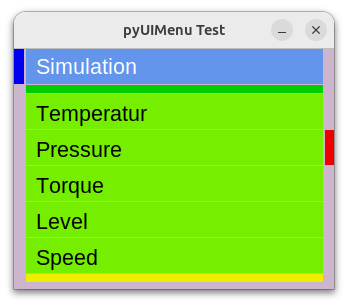

# pyUMenu - a Python Cross Platform, Menu based User Interface

As more even the smallest controller devices have some tiny displays today, as more projects make some use of it.

While many projects certainly need some beautiful tailored UIs, there are on the other side many mostly technical apps, which do not care about beauty 
and just want to give the user some ways to act with the application. In such cases its mostly annoying to create a new UI each time from scratch again- thats where UI toolkits come in place.

In python there are many beautiful toolkits available (Kivy, dearpyGui etc.), but they all expect a powerful engine to render the graphics. On tiny devices like an ESP32 they are an absolut overkill and would not run at all.

The embedded guis (namely displayio of circuitpython) are usable to place single elements, but a complete screen layout is also an time consuming development process, which repeats
on each new project.

That is where pyUIMenu might can help.

## The pyUIMenu Concept
pyUIMenu (pmu) does not have widgets or layouts. It's all condensed down to a (herarical) list of items, where a selection of an item can either jump into another itemlist or change the value of that item.

As embedded devices mostly have no keyboards, textual inputs are also not foreseen. Values can only be changed with the up/down buttons in a predefined manner.

## Inputs
Embedded systems can have different input devives, namely buttons, rotary knows and touchscreen. pyUIMenu can handle them all simultaneously by just acting to input events which come from the application.

----

This as just first documentation, more to follow..
